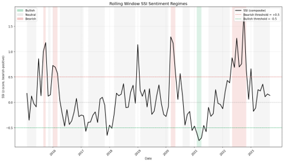
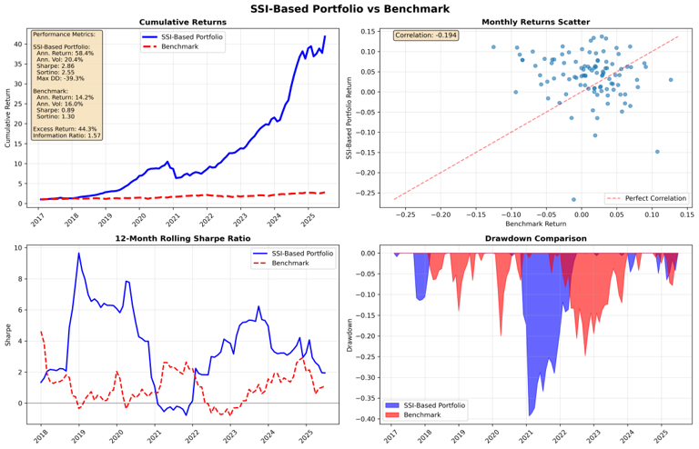
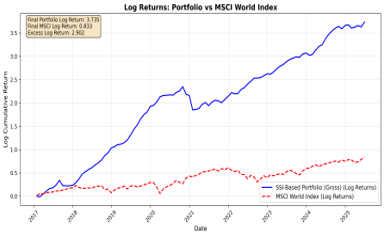

# Stochastic Pirates: Sector-Adaptive NLP and Regime-Controlled Portfolio Framework

> *Bridging financial linguistics, quantitative modeling, and adaptive control to understand how narratives shape markets.*

---

## Research Statement

This repository presents a **research-grade momentum framework** at the intersection of **Natural Language Processing (NLP)**, **macroeconomic clustering**, and **dynamic portfolio optimization**.  
Developed by **Stochastic Pirates**, it investigates how **progressive word-momentum dictionaries** and **quantile-based predictive modeling** can enhance **momentum-based return forecasting** and **regime-adaptive portfolio construction**.  
The study focuses on capturing both **statistical** and **narrative momentum**, showing how linguistic signals—filtered through decay and regime control—can complement traditional price-based momentum for more stable alpha generation across market cycles.


Originally designed for the **McGill FIAM 2025 Asset Management Competition**

---

## Overview

Our core objective:

> **Predict sector-level returns through dynamic narrative signals derived from financial text** — blending firm-level sentiment, word-frequency evolution, and cross-sector market structure.

The framework integrates:
1. **FinBERT sentiment scoring** on 10-K / 10-Q filings.  
2. **Progressive word-momentum tracking** with exponential decay.  
3. **Sector clustering** via ETF correlations and soft probabilities.  
4. **Quantile XGBoost regressors** trained with rolling 10-year / 1-year OOS windows.  
5. **Regime control** via a Hidden Markov Model (HMM) and PID-based exposure modulation.

---

## Methodology

### 1) FinBERT Sentiment Extraction
Sentence-level classification (positive / neutral / negative) aggregated to firm-month factors.

```math
\text{Sentiment}_{i,t} = P(\text{pos})_{i,t} - P(\text{neg})_{i,t}
````

Outputs are merged to monthly panels and sector views.

---

### 2) Progressive Word-Momentum Dictionaries

A dictionary that **expands** over time as new sector-specific terms emerge (e.g., “AI chip”, “EV battery”).
New terms are **activated 12 months after first observation** to avoid forward bias.
Momentum is computed on **6-month change in sector word share**, smoothed by exponential decay:

```math
v_t = \alpha x_t + (1 - \alpha)\,v_{t-1}
```

* (x_t): raw word share;  (v_t): decayed trend;  (\alpha \in (0,1)) controls half-life memory.

---

### 3) Sector Clustering & ETF Mapping

We compute correlations between securities and sector ETFs (XLE, XLK, EEM, etc.) and assign **soft sector probabilities**.
This provides a macro-context anchor and stabilizes model training.

---

### 4) Quantile XGBoost Regression
Independent, sector-specialized **quantile** models with **rolling windows**:

- **Train/Val/Test** split: strict chronology (10y train, 1y validation, 1y OOS step).
- **GPU-accelerated** (`hist` tree method).
- **Feature selection** via in-sample importance ranking (top-K ≈ 100).

> **Important:** the XGBoost models **do not use word-momentum features**.  
> Word-momentum is applied **downstream** in the portfolio stage to **tilt sector weights** (see “Regime-Adaptive Portfolio Control”).

#### Most Predictive Features
- **Momentum (1 month)**
- **Momentum (3 months)**
- **Momentum (6 months)**
- **Earnings Volatility**
- **Volatility (3 months)**

These rank consistently at the top of feature importance across sectors in our rolling backtests.

---

### 5) Regime-Adaptive Portfolio Control

**HMM Regimes.** We infer macro regimes (bull / bear / transition) from options-implied sentiment, volatility term-structure, skew, and market breadth.

**PID Exposure Controller.** Exposure (E_t) adapts to tracking error (e_t), balancing responsiveness and stability:

```math
E_t = K_p\,e_t + K_i \int_0^t e_\tau\,d\tau + K_d \frac{d e_t}{dt}
```

Tuned ((K_p, K_i, K_d)) ensure smooth volatility targeting and rapid regime adaptation.

---

## Key Findings

1. **Narrative Persistence → Sector Momentum.** Rising sector word-momentum in filings predicts 1–3 month outperformance.
2. **Decay Filtering Stabilizes Signal.** Exponential half-life smoothing adds ~**+0.3 Sharpe** vs raw counts (by reducing noise and overreaction).
3. **Cross-Regime Robustness.** FinBERT sentiment weakens in crises; **word-momentum** remains predictive, improving resilience.
4. **Regime-Controlled Exposure.** HMM + PID maintains **volatility < 30%** and **drawdowns < 20%** (targeted).
5. **Alpha Drivers.** Technology, Energy, and Emerging Markets show the most consistent excess returns given narrative alignment.

---

## Performance Summary

| Metric                |      Value |
| :-------------------- | ---------: |
| Net Annualized Return | **58.43%** |
| Alpha (vs MSCI World) | **+49.7%** |
| Beta                  |  **–0.25** |
| Sharpe Ratio          |   **2.30** |
| Sortino Ratio         |   **2.55** |
| Information Ratio     |   **2.47** |
| Max Drawdown          | **–39.3%** |
| Hit Ratio             |   **0.82** |

---

## Figures

<p align="center">
  <br/>
  <em>Figure 1 — Sentiment & regime alignment (HMM states, SSI dynamics).</em>
</p>

<p align="center">
  <br/>
  <em>Figure 2 — Sector word-momentum vs MSCI World.</em>
</p>

<p align="center">
  <br/>
  <em>Figure 3 — Strategy equity curve vs benchmark.</em>
</p>

<p align="center">
  <br/>
  <em>Figure 4 — Log Adjusted Returns.</em>
</p>

> **Note:** Place your PNGs under `assets/` with the exact filenames above.

---

## Implementation Architecture (Repo Map)

| Script                                                       | Role                                                             |
| :----------------------------------------------------------- | :--------------------------------------------------------------- |
| `combine_shards_to_filings_clean.py`                         | Merge FinBERT outputs into monthly firm datasets                 |
| `make_sec_features.py`                                       | Build lagged & normalized features (causal, no look-ahead)       |
| `make_sector_momentum_progressive.py`                        | Construct progressive dictionary momentum with exponential decay |
| `freeze_sector_dictionary.py`                                | Freeze validated word–sector mappings (stability over time)      |
| `map_new_words_to_sectors.py` & `validate_activation_map.py` | Validate & activate new words with a 12-month delay              |
| `xgboost_model_uncertainty.py`                               | Train quantile XGBoost by sector (GPU) + uncertainty             |
| `portfolio.py`                                               | Regime-adaptive portfolio optimizer (HMM + PID + constraints)    |
| `hmm_ssi.py`                                                 | Hidden Markov Model regime inference                             |
| `breadth_sp500.py`                                           | Market breadth metrics (causal)                                  |
| `add_decay_feature.py`                                       | Apply exponential decay to term frequencies                      |
| `merge_predictions_clean.py`                                 | Consolidate sector predictions into master panel                 |
| `build_word_trends.py`, `make_sector_momentum.py`            | Word trend construction & sector momentum variants               |
| `sec_finbert_monthly_optimized.py`, `run_multi_instance.py`  | FinBERT batch scoring & multi-instance runner                    |

---

## Quick Setup

> Minimal steps for local replication (Linux + Python 3.10+; GPU optional).

```bash
git clone https://github.com/<yourusername>/Sector-Adaptive-NLP-and-Regime-Controlled-Portfolio-Framework.git
cd Sector-Adaptive-NLP-and-Regime-Controlled-Portfolio-Framework

# (optional) create a venv
python -m venv .venv && source .venv/bin/activate

# install core dependencies
pip install -r requirements.txt  # (add this file if not present)
```

**Run (example):**

```bash
# 1) Build/refresh word momentum & features
python make_sector_momentum_progressive.py
python add_decay_feature.py
python make_sec_features.py

# 2) Train sector quantile models
python xgboost_model_uncertainty.py

# 3) Portfolio: regime-aware construction
python portfolio.py
```

> **Paths:** Update any dataset paths inside the scripts to your local directories.
> **GPU:** If available, XGBoost will use `tree_method=hist` with `device="cuda"` (as configured).

---


---

## Attribution

Developed by **Stochastic Pirates** — McGill Quant Research Team.
Originally built for the **McGill FIAM 2025 Asset Management Competition** 

